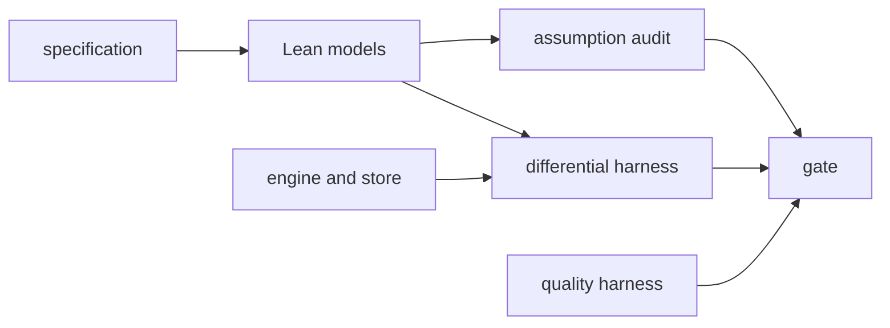

# Assurance

## What it is for

**Contextful** makes claims a buyer acts on: a reader receives only the rows policy
admits, and a stale lease holder never commits. Assurance decides what evidence stands
behind each claim and keeps the claim no wider than that evidence. It has three layers.
Lean models prove properties of the specification. A differential harness ties each model
to the code that runs. Engineering gates and a quality harness turn the tree's discipline
and the read path's quality into a red or green verdict.

## How it works

The models are written from the specification text, not the engine source
({{assurance.model.from-the-spec}}), so a theorem checks the specification rather than
restating the code. The policy package depends on no external library
({{assurance.model.declared-dependency}}), pins its toolchain
({{assurance.model.toolchain-drift}}), and keeps every definition total
({{assurance.model.total-definitions}}). The protocol package models lease, compare-and-swap
and fence as a step function ({{assurance.model.protocol-model}}) whose invariants are
theorems ({{assurance.model.protocol-safety}}) and a bounded check
({{assurance.model.protocol-check}}).

The theorems cover layer composition ({{assurance.prove.composition-sound}}), narrowing
({{assurance.prove.narrowing}}) and the evidence floor
({{assurance.prove.floor-no-downgrade}}), over the one order the engine applies
({{assurance.prove.order-is-specified}}). Each carries its negative space, the premises it
leaves open ({{assurance.prove.negative-space}}).

A proof counts only if the audit accepts it. The verdict reads the elaborated environment
and the inventory alone ({{assurance.audit-assumptions.verdict-input}}), because a build exits
zero over a hole. Each required constant's assumption footprint is read transitively
({{assurance.audit-assumptions.transitive-audit}}) against a fixed allowlist
({{assurance.audit-assumptions.allowlist}}), and its statement must match the inventory
({{assurance.audit-assumptions.statement-drift}}). A recheck repeats this from pinned source in
an environment holding no credential ({{assurance.recheck.credential-free}}).

The claim is one sentence ({{assurance.scope-claim.claim-sentence}}) naming decisions,
specifications and trusted dependencies ({{assurance.scope-claim.trusted-dependencies}}).
Refinement reaches pure decision functions only ({{assurance.scope-claim.refinement-scope}}).

Beneath the proofs sit the engineering rules: one implementation per capability
({{assurance.structure-tree.one-home}}), a failing test before a source change
({{assurance.test.test-first}}), and ordered gate stages
({{assurance.gate.stage-sequence}}), each a remote check invoking the local subcommand
({{assurance.gate.remote-check}}). The quality harness loads its corpus through the real
store ({{assurance.evaluate.through-the-store}}) under policy labels
({{assurance.evaluate.policy-labels}}), and baselines only ever rise
({{assurance.baseline.raise-only}}).

## Worked example

A contributor changes the engine's layer composition so that masking runs before
filtering.

The change alters Rust source, so it carries a test that fails against the base commit;
without one the test-first stage stops it. The gate then reaches the formal stage
({{assurance.gate.formal-stage}}).

Suppose the contributor also edits the Lean statement of the composition theorem to
match. The inventory is edited apart from the declarations
({{assurance.audit-assumptions.inventory}}), so the elaborated statement no longer matches its
expected text and the check command fails ({{assurance.audit-assumptions.check-command}}). A
proof finished with a hole fails on its footprint
({{assurance.audit-assumptions.hole-assumption}}), whatever the syntax spells.

Suppose instead the Lean side stays untouched. The differential harness feeds generated
cases to the reference binary and the engine ({{assurance.differential-test.harness}}).
A case where a masked column meets a row filter decides differently, shrinks to a minimal
form ({{assurance.differential-test.minimized}}), enters the counterexample corpus
({{assurance.differential-test.discarded-counterexample}}), and replays before fresh cases
on every later run ({{assurance.differential-test.corpus-replay}}), reproducible from the
recorded seed ({{assurance.differential-test.seed}}).

Suppose finally the reorder survives both. The evaluation run still fails if a
must-not-retrieve row appears ({{assurance.evaluate.forbidden-row-rate}}).

The published claim never outruns this evidence. The composition theorem is not a
mediation theorem ({{assurance.prove.mediation-from-composition}}), stages are not claimed
to commute ({{assurance.prove.commutation-claim}}), and a clause pins at most one theorem
beside one test ({{corpus.state.theorem-beside-test}}).

## Where to look

| Question | Operation |
| --- | --- |
| What does a theorem leave open? | `assurance.prove` |
| Why did the proof gate fail? | `assurance.audit-assumptions` |
| What may the claim say? | `assurance.scope-claim` |
| Which gate stage runs what? | `assurance.gate` |
| When does quality go red? | `assurance.evaluate`, `assurance.baseline` |
