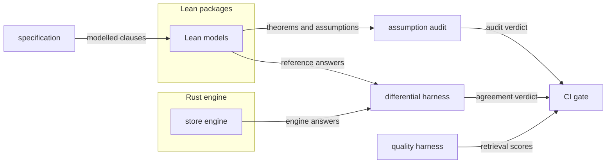

# Assurance

## What it is for

**Contextful** makes claims a buyer acts on: a reader receives only the rows policy
admits, and a stale lease holder never commits. Assurance decides what evidence stands
behind each claim and keeps the claim no wider than that evidence: Lean models prove the
specification, a differential harness ties each model to the running code, and gates turn
discipline and retrieval quality into a red or green verdict.

## In plain words

Think of **Contextful** as a librarian who makes two promises: you only get the books
your card allows, and two librarians never stamp the same book at once. Assurance is how
anyone checks those promises without taking the librarian's word for it.

- **The math check.** A proof assistant reads the rulebook, not the code, and proves the
  promises follow from it. An auditor confirms no proof hides a skipped step
  ({{assurance.audit-assumptions.hole-assumption}}), like a teacher marking the working.
- **The twin check.** A small reference program built from the proofs and the real engine
  answer the same made-up questions ({{assurance.differential-test.harness}}). A
  disagreement shrinks and is saved, so every later run asks it first
  ({{assurance.differential-test.corpus-replay}}).
- **The house rules.** Every code change arrives with a test that failed before it
  ({{assurance.test.test-first}}), the gate runs its stages in a fixed order
  ({{assurance.gate.stage-sequence}}), and search results are scored against rows that
  must never appear ({{assurance.evaluate.forbidden-row-rate}}).

The promise printed on the box is never bigger than what these checks show.

## How it works

Models follow the specification text, not the engine source
({{assurance.model.from-the-spec}}). The policy package depends on no external library
({{assurance.model.declared-dependency}}), pins its toolchain
({{assurance.model.toolchain-drift}}), and keeps every definition total
({{assurance.model.total-definitions}}). The protocol package models lease, compare-and-swap
and fence as a step function ({{assurance.model.protocol-model}}) whose invariants are
theorems ({{assurance.model.protocol-safety}}) and a bounded check
({{assurance.model.protocol-check}}).

The theorems cover layer composition ({{assurance.prove.composition-sound}}), narrowing
({{assurance.prove.narrowing}}) and the evidence floor
({{assurance.prove.floor-no-downgrade}}), over the one order the engine applies
({{assurance.prove.order-is-specified}}). Each carries its negative space, the premises it
leaves open ({{assurance.prove.negative-space}}).

A proof counts only if the audit accepts it, reading the elaborated environment and the
inventory alone ({{assurance.audit-assumptions.verdict-input}}), because a build exits
zero over a hole. Each required constant's assumption footprint is read transitively
({{assurance.audit-assumptions.transitive-audit}}) against a fixed allowlist
({{assurance.audit-assumptions.allowlist}}), and its statement must match the inventory
({{assurance.audit-assumptions.statement-drift}}). A recheck repeats this from pinned source in
an environment holding no credential ({{assurance.recheck.credential-free}}).

The claim is one sentence ({{assurance.scope-claim.claim-sentence}}) naming decisions,
specifications and trusted dependencies ({{assurance.scope-claim.trusted-dependencies}}).
Refinement reaches pure decision functions only ({{assurance.scope-claim.refinement-scope}}).

Beneath the proofs sit the engineering rules: one implementation per capability
({{assurance.structure-tree.one-home}}), a failing test before a source change
({{assurance.test.test-first}}), and ordered gate stages
({{assurance.gate.stage-sequence}}), each a remote check invoking the local subcommand
({{assurance.gate.remote-check}}). The quality harness loads its corpus through the real
store ({{assurance.evaluate.through-the-store}}) under policy labels
({{assurance.evaluate.policy-labels}}), and baselines only ever rise
({{assurance.baseline.raise-only}}).

## Worked example

A contributor changes the engine's layer composition so that masking runs before
filtering.

It carries a test failing against the base commit, or the test-first stage stops it. The
gate then reaches the formal stage
({{assurance.gate.formal-stage}}).

If the contributor also edits the composition theorem's Lean statement to match, the
inventory, edited apart from the declarations ({{assurance.audit-assumptions.inventory}}), no
longer matches and the check command fails ({{assurance.audit-assumptions.check-command}}). A
proof finished with a hole fails on its footprint
({{assurance.audit-assumptions.hole-assumption}}), whatever the syntax spells.

Otherwise the differential harness feeds generated
cases to the reference binary and the engine ({{assurance.differential-test.harness}}).
A case where a masked column meets a row filter decides differently, shrinks to a minimal
form ({{assurance.differential-test.minimized}}), enters the counterexample corpus
({{assurance.differential-test.discarded-counterexample}}), and replays before fresh cases
on every later run ({{assurance.differential-test.corpus-replay}}), reproducible from the
recorded seed ({{assurance.differential-test.seed}}).

If the reorder survives both, evaluation still fails if a
must-not-retrieve row appears ({{assurance.evaluate.forbidden-row-rate}}).

The published claim never outruns this evidence. The composition theorem is not a
mediation theorem ({{assurance.prove.mediation-from-composition}}), stages are not claimed
to commute ({{assurance.prove.commutation-claim}}), and a clause pins at most one theorem
beside one test ({{corpus.state.theorem-beside-test}}).

## Where to look

| Question | Operation |
| --- | --- |
| What does a theorem leave open? | `assurance.prove` |
| Why did the proof gate fail? | `assurance.audit-assumptions` |
| What may the claim say? | `assurance.scope-claim` |
| Which gate stage runs what? | `assurance.gate` |
| When does quality go red? | `assurance.evaluate`, `assurance.baseline` |
