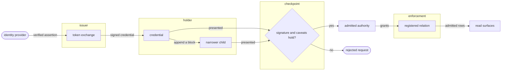

# Authority and enforcement

## What it is for

Every row **Contextful** returns or lands answers to one question: who asked, on whose
behalf, and what did they hold? The contract splits that question in two. Admission turns a
presented credential into a verified value once; enforcement rewrites every read so that
value decides which rows and cells survive. Nothing downstream trusts ambient state, a
flag or a second secret.

## How it works

A subject is a tuple of agent, host, principal, task, zone and incognito flag
({{authority.identify.subject-tuple}}). Only the principal is verified, at the mint against
the identity provider ({{authority.identify.on-behalf-of}}); the rest render as asserted
({{authority.identify.attestation}}). A credential is a chain-signed Biscuit token under a
versioned profile that names every admitted element ({{authority.profile.delegation-profile}}). Its
grants name actions, table patterns and optional tenant, template and aggregate bounds
({{authority.grant.fields}}), over a four-word action vocabulary
({{authority.grant.actions}}).

Minting needs a grant carrying `admin` ({{authority.issue.unauthorized-mint}}) and runs
through one signing port ({{authority.issue.signing-port}}) under a persisted lifetime ceiling
({{authority.issue.ceiling}}). A port answering ES256 as `r ‖ s` converts to DER at the port
({{authority.issue.der-at-the-edge}}). An embedding application instead exchanges its signed-in
reader's assertion for that reader's short-lived credential
({{authority.exchange.per-reader}}), with grants drawn from the policy alone
({{authority.exchange.minted-grants}}).

A holder narrows a credential offline by appending a signed block
({{authority.attenuate.offline}}); every dimension obeys the narrowing table, checked at
derivation and again over the whole chain ({{authority.attenuate.narrowing}}).

A checkpoint holds public keys only and calls no service to admit
({{authority.verify.public-key-only}}). Each request proves possession of the credential's
bound key ({{authority.verify.possession-binding}}). Verification yields the admitted-authority
value every read and row-landing effect takes as an argument
({{authority.verify.admitted-authority}}), and no constructor fabricates one
({{authority.verify.no-bypass-constructor}}). Each statement start and commit re-reads expiry,
revocation and policy version ({{authority.verify.effect-boundary}}). Withdrawal leans on short
lifetimes ({{authority.revoke.short-lifetime}}), with a revocation identifier per derivation
({{authority.revoke.revocation-id}}).

Enforcement is three layers ({{authority.compose.three-layers}}). Write-time redaction removes
values before columnar bytes exist ({{authority.redact.write-time}}), and it is the only layer
that protects data at rest ({{authority.redact.at-rest-scope}}). The redistribution bound
withholds a table from the bucket at push ({{authority.bound-redistribution.withhold}}). At
query time the compiler binds one registered relation per granted table
({{authority.compose.registered-relation}}), applying steps in a fixed order
({{authority.compose.relation-order}}), each only removing rows
({{authority.compose.conjunctive-narrowing}}), all before a ranked result is cut
({{authority.compose.before-the-cut}}). Masks substitute columns in place
({{authority.mask.in-place}}), and an inference zone the table does not admit drops the row
({{authority.place.excluded-row}}). A table declaring no zone policy resolves to a
fail-closed pair ({{authority.place.fail-closed}}). A refused read is a typed error, never an
empty result ({{authority.refuse.not-empty}}).

## Worked example

Dana signs into the console. It posts her identity provider's assertion to the exchange; the
policy maps her `analyst` role to `read` on `research/*`, and the `org_id` claim becomes the
tenant scope `acme-eu` on every minted grant ({{authority.exchange.tenant}}).

Her research agent spawns a sub-agent and derives it a child limited to `research/filings`,
bound to the sub-agent's own key pair ({{authority.attenuate.per-sub-agent}}). A derivation
that adds `write` refuses, naming the dimension ({{authority.attenuate.widens}}).

The sub-agent queries `research/filings` with no tenant filter. Admission passes, and the
relation conjoins a byte-exact tenant equality the query never wrote
({{authority.filter-rows.tenant-equality}}). A statement naming `acme-us` in its top-level
conjuncts is caught by the scope guard ({{authority.refuse.scope-guard}}) and refused with
both scopes named ({{authority.refuse.scope-denied}}).

The session declares `local:device`, which the table's fail-closed default admits. A
`contact_email` column tokenized by policy arrives masked where it stands. The response
envelope reports how many rows the predicate and the zone removed and which columns were
masked, carrying no removed value ({{authority.place.envelope}}).

An operator then denylists the sub-agent's derivation. At its next effect boundary the
sub-agent's credential refuses ({{authority.revoke.revoked}}), while the agent's parent credential,
carrying a different revocation identifier, keeps working.

## Where to look

| Question | Operation |
| --- | --- |
| What does a credential say? | `authority.grant`, `authority.profile` |
| Why did admission refuse? | `authority.verify`, `authority.revoke` |
| May this child exist? | `authority.attenuate` |
| Why is a row or cell missing? | `authority.compose`, `authority.place` |
| Why is a value unreadable? | `authority.mask`, `authority.redact` |
