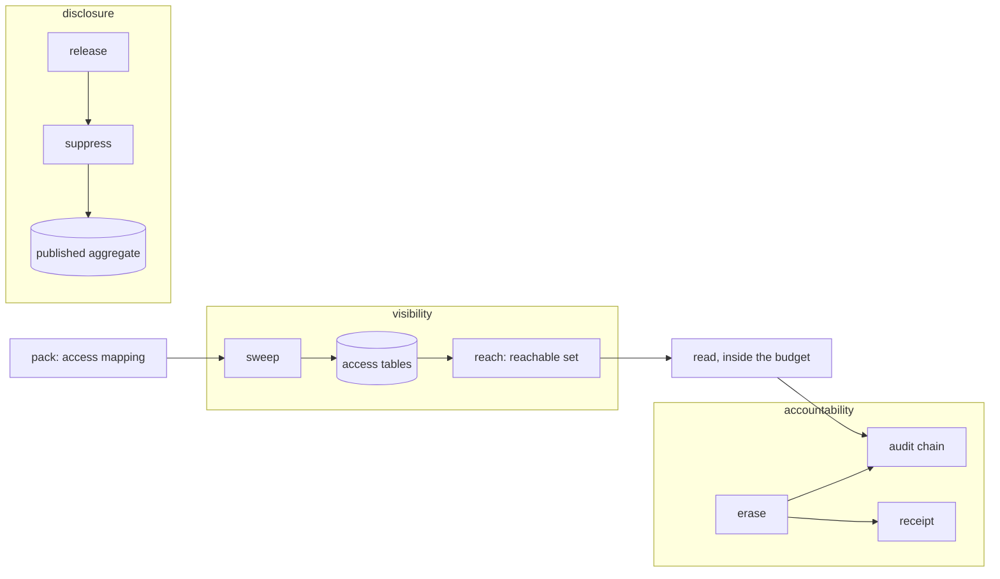

# Visibility, disclosure and accountability

## What it is for

A **Contextful** workspace that indexes an organization's wiki, drive and chat answers
everyone, so it inherits the question those sources already settled: who may see what.
This contract gives three answers. Visibility mirrors each source's permission state and
joins it into every read, so a reader sees what the source shows them and nothing more.
Disclosure lets a derived figure cross from many contributors to one asker without
carrying any contributor's rows. Accountability leaves a verifiable trace of every read
and removes a subject or a tenant on demand.

One stance runs through all three: when the evidence behind a decision is missing, stale
or unverifiable, the operation refuses with a typed error instead of returning fewer rows.
An empty answer then always means an empty corpus, never a quiet failure.

## How it works

Visibility runs in three steps. A pack lands a source with an access mapping
({{disclosure.pack.mapping-absent}}) whose keys the mapping schema defines
({{disclosure.pack.asserts-access}}). A sweep copies grants into access tables as ordinary
store data, refusing a grant with no resource ({{disclosure.sweep.orphan-grant}}) and
advancing its coverage watermark only from streams that detect gaps
({{disclosure.sweep.ungapped-stream}}). At read time, reach resolves the admitted subject
through a bounded group closure ({{disclosure.reach.closure-walk}}) to a reachable set, and
the registered view semi-joins content against it. Every served table carries a visibility
block ({{disclosure.mirror.unbound-table}}) naming a sweep and a staleness budget
({{disclosure.mirror.incomplete-binding}}), and a read past that budget refuses
({{disclosure.bound-staleness.access-stale}}).

Fidelity states how closely a table follows its source. The source family caps the claim
({{disclosure.declare-fidelity.family-bound}}), and a source that computes access with its
own sharing engine is queried live rather than mirrored
({{disclosure.declare-fidelity.computed-inputs}}).

Disclosure acts at build time, so every read path inherits it from the staged bytes. A
release reserves each contributing unit's budget before computing
({{disclosure.release.budget-reservation}}), groups only on permitted keys
({{disclosure.release.group-key}}), then withholds small groups
({{disclosure.suppress.min-group-size}}) and dominated ones
({{disclosure.suppress.contributor-share}}) behind one sentinel row. A cohort table never
narrows to one person ({{disclosure.bound-cohort.singleton-cohort}}).

Accountability starts at the read. Rows leave only after the audit entry is durable
({{disclosure.record.unpersisted-entry}}); entries hash-link into segments closed by signed
roots ({{disclosure.record.segment}}), and verification reports the earliest break
({{disclosure.attest.broken-chain}}).

## Worked example

A wiki page is shared with the group `planning`, which contains `eng-leads`, which
contains Ada.

The wiki pack maps the source's `viewer` level to read, names the `item-exception`
family, and binds the `pages` table as `mirrored` with a budget written in the grammar of
{{disclosure.bound-staleness.budget-grammar}}. The sweep lands one resource row, one grant
to `planning`, and two membership rows.

Ada asks a question touching `pages`. Reach walks `planning`, then `eng-leads`, then Ada,
subtracts tombstones in force, and caches the set ({{disclosure.reach.cache-capacity}}).
The source lag sits inside the budget, so the semi-join admits the page and the envelope
reports fidelity and lag. The read appends a chain entry carrying a keyed digest of the
statement, and rows return after the fsync.

An editor then removes `planning` from the page. The budget bounds how long the old grant
keeps answering. If the sweep stalls past it, Ada's next read refuses instead of serving a
revoked grant, and nothing produced in that state is retained
({{disclosure.reach.degraded-uncached}}).

Ada asks why Bo cannot see the page. Explain answers with the decision and its path, names
groups without their members ({{disclosure.explain.groups-not-members}}), and returns
nothing from the page itself ({{disclosure.explain.no-row}}).

Ada leaves and is erased. The caller holds the forget grant ({{disclosure.erase.privilege}});
the cascade invalidates facts derived from her rows ({{disclosure.erase.cascade}}) or
commits nothing ({{disclosure.erase.cascade-unbounded}}); files holding her rows are
rewritten or collected ({{disclosure.erase.physical-removal}}). A tenant purge goes further
and returns a signed receipt naming a salted pseudonym ({{disclosure.receipt.pseudonym}})
and claiming no more than its version covers ({{disclosure.receipt.widened-claim}}).

## Where to look

| Question | Operation |
| --- | --- |
| Which table claims which fidelity? | `disclosure.declare-fidelity` |
| How old may permission state be? | `disclosure.bound-staleness` |
| When is a group withheld? | `disclosure.suppress` |
| Why can this person see that page? | `disclosure.explain` |
| What does a purge prove? | `disclosure.receipt` |
