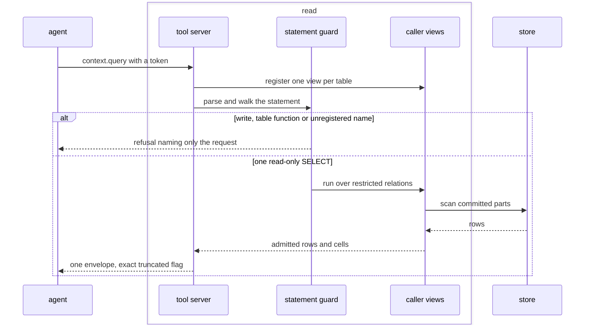
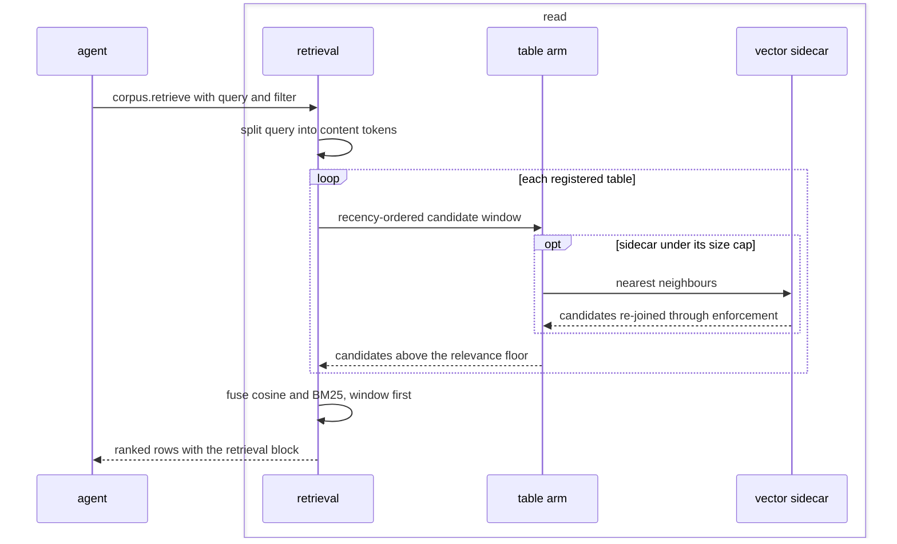
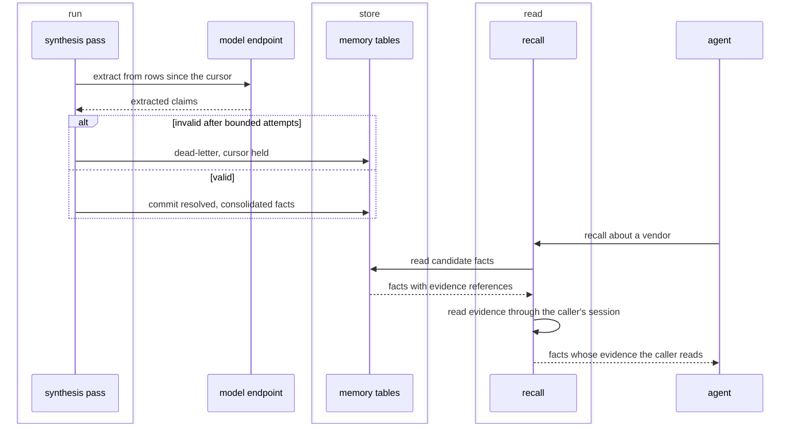

# Reading and memory

## What it is for

This contract covers SQL, templates, ranked retrieval and memory. It fixes named relations, statement admission, candidate ranking and the answer envelope. Reads write no rows. Memory uses the run path and table enforcement.

## How it works

Each connection starts by registering one view per table the manifests name ({{read.register.connection-views}}). Each view carries the caller's restriction, so a bare table name anywhere means the caller's restricted relation ({{read.register.bare-name}}). The tool set is closed ({{read.register.tool-set}}). Reads under one key share a pooled connection ({{read.cache.session-pool}}).

The guard reads the engine's parse tree ({{read.guard.engine-own-parse}}), admits exactly one read-only SELECT ({{read.guard.single-read-only-statement}}), and walks the whole tree ({{read.guard.whole-tree-walk}}), checking every base relation against the registered set ({{read.guard.relation-allowlist}}). Authorship decides whether the guard runs: operator text runs raw, token-holder text is gated ({{read.guard.statement-provenance}}); the command line carries the operator verb ({{read.query.operator-verb}}). Caller parameters bind by name or contiguous number ({{read.guard.query-binding}}). Templates are checked once at startup ({{read.guard.startup-time-check}}) and bind arguments with no coercion ({{read.guard.template-binding}}).

Ranked reads go through `corpus.retrieve` ({{read.retrieve.ranked-call}}), which works as a funnel. Query text becomes content tokens ({{read.retrieve.content-tokens}}). Each table contributes an arm over a recency-ordered candidate window ({{read.retrieve.candidate-window}}); a vector or full-text sidecar widens that window without changing any row's score ({{read.retrieve.sidecar-generates-candidates}}), and a full-text probe finds a term anywhere in the snapshot ({{read.retrieve.fulltext-probe}}); a relevance floor drops noise ({{read.retrieve.relevance-floor}}). Ranking fuses exact cosine with BM25 ({{read.rank.fusion}}), and a question's timeframe leads the ordering as a tier rather than a filter ({{read.rank.question-window-is-a-tier}}). A missing lexical backend changes the order, never whether the read answers ({{read.rank.degradation-not-error}}).

Every transport serializes one projection ({{read.respond.one-projection}}). The opt-in internals block carries query bindings ({{read.respond.query-internals-parameters}}). `truncated` is exact, set by an over-fetched probe row ({{read.respond.truncation-is-exact}}), and zero rows is a success ({{read.respond.zero-rows-is-success}}). A caller may pin tables to published builds, and a pin never silently widens to the latest state ({{read.resolve-pin.unknown-build}}).

Memory keeps episodes, facts, entities, edges and preferences as ordinary store tables ({{topology.compose.memory-substrate}}). Synthesis extracts, resolves and consolidates. An extraction failing validation is re-prompted a bounded number of times ({{read.synthesize.extract-attempts}}), then dead-lettered with the cursor held ({{read.synthesize.dead-letter}}). An ambiguous entity mention dead-letters instead of merging ({{read.resolve-entity.ambiguous-mention}}). Recall serves a claim only when all of its evidence reads through the caller's own session ({{read.recall.evidence-unresolved}}), so memory never tells a caller what that caller could not read directly. Settlement scores registered predictions against observed outcomes ({{read.settle.registration}}).

## Worked example

An agent holding a capability token wants the current renewal terms for one vendor.

- It calls `context.describe` and learns row counts, declared indexes and the published row ceiling ({{read.register.describe-payload}}), which the engine applies exactly as published ({{read.register.advertised-is-enforced}}).
- It sends SQL that joins `contracts` to a `read_parquet` call, and the guard refuses the table function ({{read.guard.table-function}}). It retries with a join to `payroll`, which it holds no grant on; the refusal echoes only what it asked for ({{read.guard.unregistered-relation}}).
- It switches to `corpus.retrieve` with the query "vendor renewal terms" and a filter on `vendor_id`. A table lacking `vendor_id` drops its arm instead of running unfiltered ({{read.retrieve.unsatisfiable-arm-drops}}). The `contracts` vector sidecar sits under its size cap ({{read.retrieve.sidecar-size-cap}}), so the probe adds candidates, each re-joined through enforcement ({{authority.compose.vector-arm}}).
- Rows keep one copy per table and row key ({{read.retrieve.row-key-dedup}}), sort in-window first, and return with the `contextful.retrieval` block ({{read.rank.retrieval-block}}). Each row carries an integer score; the lexical engine's float score stays inside ({{read.rank.internal-score-stays-internal}}).
- To report that no contract mentions a penalty clause, the agent relies on a count over the table, never a low top score ({{read.respond.coverage-is-a-count}}).
- It asks memory what the workspace concluded about the vendor. One fact cites a row in a table masked for this caller, so recall suppresses that fact and still answers with the rest ({{read.recall.evidence-unresolved}}).

## Where to look

- What a connection can name: `read.register`.
- Which statements run: `read.guard`.
- The envelope and its encodings: `read.respond`.
- Candidates and order: `read.retrieve`, `read.rank`.
- Build pins and time bounds: `read.resolve-pin`.
- Memory writes and reads: `read.synthesize`, `read.revise`, `read.recall`, `read.resolve-entity`.
- Predictions and outcomes: `read.settle`.
