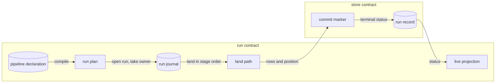

# Runs, pipelines and derive

## What it is for

A run is how data enters **Contextful** and survives interruption. A pipeline declares what
to pull and which tables it lands; a run executes it once against a pinned plan, and either
commits rows with the position behind them or leaves a resume point. The derive tier reuses
the machinery for per-row work over landed rows, such as turning a recording into passages.
Every effect a run makes is recorded, so a replay reads the record instead of repeating the
outside world: the journal is a flight recorder the next attempt flies from.

## How it works

A pipeline specification ({{run.declare.pipeline-spec}}) is identified by a content hash
that ignores no-op edits ({{run.declare.content-hash}}). It compiles into a flat node list ({{run.compile.plan-node}})
carrying no script: branching is declared, never computed from data
({{run.compile.control-flow}}), and the plan lowers onto one substrate interface
({{run.journal.substrate-port}}).

At run open the engine writes a record row before the first pull ({{run.record.row-at-open}})
and binds the work to an execution owner that pins the connector build and plan hash while
work is pending ({{run.own.pinned-plan-changed}}): output replayed into a different build
describes code that never produced it.
Host jobs open it under their own scope ({{run.own.host-scope}}).

Each pull is a journaled step: its value is recorded once while its effect may run more than
once ({{run.journal.step-output}}), and each outbound request carries an idempotency key
derived from the entry key ({{run.journal.idempotency-key}}). The journal, its blobs and the
awakeable registry persist through three store ports, so a host brings its own
store; the file tree ({{run.journal.storage-ports}}) and a SQLite file
({{run.journal.sqlite-stores}}) are adapters. A batch then passes one fixed
stage order ({{run.land.stage-order}}). Rows and the new cursor commit on one marker
({{run.advance.commit-with-rows}}), so no crash leaves one moved without the other.

Failures cross every port as one tagged type ({{run.retry.failure-taxonomy}}). Only the
transient and rate-limited tags retry ({{run.retry.retryable-classes}}), under the step's
schedule, the only retry layer in the stack ({{run.retry.one-layer}}). A stop is a mark on the
run row that every await observes through one token ({{run.cancel.one-token}}), and landing
is never cut mid-write ({{run.cancel.land-path-uncut}}). A run waiting on an outside party
suspends durably until its single-use token is posted back ({{run.suspend.awakeable}}).

Every run closes on a status from one shared set ({{run.record.status-set}}); live progress is
a best-effort projection the runner never reads back ({{run.project.best-effort}}).

A backfill splits history into leased chunks whose commits are fenced against a stale holder ({{run.backfill.fenced-commit}}); a seed bulk-loads
consumer-held history below a ceiling through the same land path ({{run.seed.one-land-path}}).
The derive tier recomputes its outstanding units each tick by anti-joining its own output
({{run.select.rows-per-run}}), runs an engine the machine defines rather than the manifest
({{run.bind.command-in-manifest}}), and records every unit's fate in its own table
({{run.emit.unit-status}}).

## Worked example

The `meta-ads` pipeline pulls ad insights incrementally. Its declaration names `updated_time`
as the stream clock ({{run.declare.incremental-field}}), so the source reports a monotonic
cursor that stores the field name beside the value ({{run.advance.watermark-shape}}).

With no pending owner, a fire receives a fresh execution id ({{run.own.retirement}}). The pull admits rows at or after the stored position, re-landing
the boundary instant ({{run.advance.inclusive-boundary}}); `insights` declares a
`primary_key`, so those repeats are idempotent ({{run.advance.declared-key-required}}).

The first page is journaled and written; then the process dies before commit.

On restart, startup marks the row `partial_failure` because its owner lease has expired
({{run.record.orphan-reap}}). The next fire finds no commit marker newer than the cached
position ({{run.own.marker-reconciles}}), sees the same plan hash, and replays. The
journal hit hands the recorded page to the land path byte for byte
({{run.journal.replay-lands}}), and replay spends no vendor request
({{connector.meter.replay-reservation}}). The remaining pages pull live and commit with the
position, and `success` releases the owner ({{run.own.pin-release}}).

Had the author renamed `updated_time` between the two fires, the open refuses before any
request leaves the host ({{run.advance.field-rename}}); starting over is an explicit act
({{run.advance.turning-incremental-on}}).

## Where to look

| Question | Operation |
| --- | --- |
| Why did a replay skip the vendor? | `run.journal` |
| When does the cursor move? | `run.advance` |
| Why did a step stop retrying? | `run.retry` |
| What does a stop leave behind? | `run.cancel` |
| How does a batch reach the store? | `run.land` |
| How does history load? | `run.backfill`, `run.seed` |
| How does derive pick and settle units? | `run.select`, `run.emit` |
