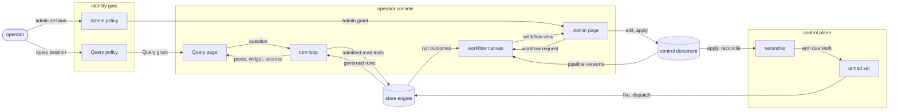

# Operator surfaces

## What it is for

Query answers questions with grounded prose, widgets and sources
({{surface.ground.sources-block}}). Admin visualizes deployed workflows ({{surface.visualize.workflow-canvas}}), run outcomes
and learnings, and edits the versioned control document ({{surface.open-console.engine-faces}}). Hosted deployments gate each page
and its API ({{surface.open-console.identity-gate}}, {{surface.open-console.page-grants}}).
The control plane arms only work the engine names;
Query reaches rows through governed reads under the operator's own credential
({{assurance.structure-tree.one-home}}).

## How it works

The operator plane is a pipeline from a document to a running unit. Edit keeps the
document free of secret material ({{surface.edit.secret-in-document}}) and refers to
connectors by registered id ({{surface.edit.connector-upload}}). Apply validates before
claiming anything ({{surface.apply.validation}}), then claims an immutable version by
compare-and-swap ({{surface.apply.version-race}}) on a backend whose conditional write is
linearizable ({{surface.apply.weak-conditional-backend}}). Reconcile polls the snapshot
pointer ({{surface.reconcile.poll-cadence}}) from a loopback source
({{surface.reconcile.loopback-only}}), diffs the schedule set, and on a failed poll keeps the
armed set running ({{surface.reconcile.fail-static}}). Arm holds back an unreadable schedule
alone ({{surface.arm.unreadable-schedule}}) and evaluates due-ness from an in-process tick
({{surface.arm.tick-interval}}) or an external wake ({{surface.arm.wake-answer}}). Fire runs
only the closed kind union ({{surface.fire.job-kind-unknown}}), and dispatch fences worker
callbacks by attempt ({{surface.dispatch.callback-rejected}}). Reside refuses to serve from
a region the policy omits ({{surface.reside.region-mismatch}}).

Synced apply records an admin-attested snapshot ({{surface.apply.synced-attestation}}). Cold reconciliation verifies receipts under locally pinned issuer keys ({{surface.reconcile.issuer-pin}}) and checks local declarations ({{surface.reconcile.pulled-control}}); refusals name their reason ({{surface.reconcile.pulled-control-untrusted}}).

Each page and API route verifies the operator's Access assertion or Cognito session and that page's grant
({{surface.open-console.page-routes}}, {{surface.open-console.wrong-page}}).
Admin edit and apply also require the server's admin capability
({{surface.open-console.admin-grant}}). The Admin canvas projects pipelines, schedules,
steps and run outcomes; its edits reach the same
control document that the reconciler reads.

Query turns one question into one answer ({{surface.plan-turn.turn-flow}}). The server, never the client, chooses
every capability the turn exercises: tools come from the turn's admitted packs
({{surface.ground.unadmitted-tool}}), the query endpoint reaches no write
({{surface.ground.mutating-tool}}), and views are built server-side
({{surface.render.client-authored-view}}). Prose exists only over a tool result
({{surface.ground.ungrounded-answer}}), and the stream passes through the redactor
({{surface.speak.stream-redaction}}).

## Worked example

Admin displays the pipeline, schedule, steps and latest run. The operator applies a nightly `fold` targeting `meta_ads_insights`. The
target resolves to a produced table ({{surface.fire.target-unbound}}), so validation
passes. A second operator applied a minute earlier; the compare-and-swap loses, and the
operator surface reloads the winner and reapplies the pending edit onto it. The next poll arms the
job, and at its instant dispatch starts one instance. A worker running the fold goes
silent; after the lapse its work moves to another worker under the next attempt
({{surface.dispatch.heartbeat-lapse}}), and the silent worker's late callback changes
nothing.

Next morning the operator opens Query on the `field-notes` store. Its registry entry
carries no credential name of its own; the name derives from the id
({{surface.register-store.authored-name}}). The server re-verifies the perimeter assertion
and mints a per-reader credential, falling back or refusing as
{{surface.ground.mint-refused}} states.

The operator asks which filings landed this week. The vantage parses as a calendar day
({{surface.set-vantage.unparseable}}); recall reads prior conclusions; the planner picks a
read tool over data tables, never memory relations
({{surface.plan-turn.planner-reached-memory}}). If the first round leaves the question
unanswered, the planner replans once, then falls to the code path
({{surface.plan-turn.code-path-bounds}}). Rows return through enforced relations.

The tool return splits into grounding for the model, a view and internals. Synthesis
streams through the redactor ({{surface.speak.redactor-lookahead}}). The rows carry a date
column and a measure over distinct days, so component choice draws a line
({{surface.render.component-choice}}), and a source list follows
({{surface.ground.sources-per-turn}}). After the answer,
{{surface.learn.distillation}} lands through {{read.revise.served-write}} under
{{surface.learn.unscoped}} and {{read.revise.served-scope}}. {{read.recall.keyed}}
precedes planning; {{surface.learn.write-refused}} withholds publication.

A greeting card requires a new row matching a conclusion within budget
({{surface.brief.absence-is-earned}}). The operator posts answers to team channels;
scheduled posting under a service identity refuses ({{surface.publish-answer.askerless-audience}}).

A teammate admitted only to Query sees no Admin workflow or edit API: an Admin request
with that teammate's Query grant refuses ({{surface.open-console.wrong-page}}).

## Where to look

| Question | Operation |
| --- | --- |
| Why did a schedule not arm? | `surface.arm`, `surface.reconcile` |
| Which job kinds exist? | `surface.fire` |
| Who wins two concurrent applies? | `surface.apply` |
| Which page can the operator enter? | `surface.open-console` |
| Where does the workflow graph come from? | `surface.visualize` |
| Where does an answer's material come from? | `surface.ground` |
| Which widget does a result draw? | `surface.render` |
