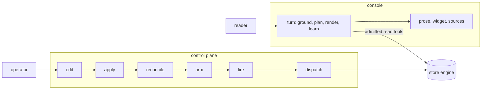

# Operator and visitor surfaces

## What it is for

Two kinds of people use a **Contextful** deployment without writing code. The operator
decides when work runs and where, through one versioned control document. The visitor, a
reader with no view of the tables, asks the console questions and receives grounded prose,
a widget and a source list. Neither surface holds data or a privileged path: the control
plane arms only work the engine names, and the console reaches rows only through governed
reads under the reader's own credential ({{assurance.structure-tree.one-home}}).

## How it works

The operator plane is a pipeline from a document to a running unit. Edit keeps the
document free of secret material ({{surface.edit.secret-in-document}}) and refers to
connectors by registered id ({{surface.edit.connector-upload}}). Apply validates before
claiming anything ({{surface.apply.validation}}), then claims an immutable version by
compare-and-swap ({{surface.apply.version-race}}) on a backend whose conditional write is
linearizable ({{surface.apply.weak-conditional-backend}}). Reconcile polls the snapshot
pointer ({{surface.reconcile.poll-cadence}}) from a loopback source
({{surface.reconcile.loopback-only}}), diffs the schedule set, and on a failed poll keeps the
armed set running ({{surface.reconcile.fail-static}}). Arm holds back an unreadable schedule
alone ({{surface.arm.unreadable-schedule}}) and evaluates due-ness from an in-process tick
({{surface.arm.tick-interval}}) or an external wake ({{surface.arm.wake-answer}}). Fire runs
only the closed kind union ({{surface.fire.job-kind-unknown}}), and dispatch fences worker
callbacks by attempt ({{surface.dispatch.callback-rejected}}). Reside refuses to serve from
a region the policy omits ({{surface.reside.region-mismatch}}).

The console turns one question into one answer. The server, never the client, chooses
every capability the turn exercises: tools come from the turn's admitted packs
({{surface.ground.unadmitted-tool}}), the visitor endpoint reaches no write
({{surface.ground.mutating-tool}}), and views are built server-side
({{surface.render.client-authored-view}}). Prose exists only over a tool result
({{surface.ground.ungrounded-answer}}).

## Worked example

The operator adds a nightly `fold` job targeting `meta_ads_insights` and applies. The
target resolves to a produced table ({{surface.fire.target-unbound}}), so validation
passes. A second operator applied a minute earlier; the compare-and-swap loses, and the
operator surface reloads the winner and reapplies the pending edit onto it. The next poll arms the
job, and at its instant dispatch starts one instance. A worker running the fold goes
silent; after the lapse its work moves to another worker under the next attempt
({{surface.dispatch.heartbeat-lapse}}), and the silent worker's late callback changes
nothing.

Next morning a reader opens the console on the `field-notes` store. Its registry entry
carries no credential name of its own; the name derives from the id
({{surface.register-store.authored-name}}). The server re-verifies the perimeter assertion
and mints a per-reader credential, falling back or refusing as
{{surface.ground.mint-refused}} states.

The reader asks which filings landed this week. The vantage parses as a calendar day
({{surface.set-vantage.unparseable}}); recall reads prior conclusions; the planner picks a
read tool over data tables, never memory relations
({{surface.plan-turn.planner-reached-memory}}). If the first round leaves the question
unanswered, the planner replans once, then falls to the code path
({{surface.plan-turn.code-path-bounds}}). Rows return through enforced relations.

The tool return splits into grounding for the model, a view and internals. Synthesis
streams through the redactor ({{surface.speak.redactor-lookahead}}). The rows carry a date
column and a measure over distinct days, so component choice draws a line
({{surface.render.component-choice}}), and a source list follows
({{surface.ground.sources-per-turn}}). After the answer, distillation writes a few
conclusions ({{surface.learn.distillation}}) under the reading-session scope
({{surface.learn.unscoped}}).

The following day the greeting card appears only because a new row matches one of those
conclusions within budget ({{surface.brief.absence-is-earned}}). If the reader wants the
answer in a team channel, posting is their own act; a scheduled job posting under a service
identity refuses ({{surface.publish-answer.askerless-audience}}).

## Where to look

| Question | Operation |
| --- | --- |
| Why did a schedule not arm? | `surface.arm`, `surface.reconcile` |
| Which job kinds exist? | `surface.fire` |
| Who wins two concurrent applies? | `surface.apply` |
| Where does an answer's material come from? | `surface.ground` |
| Which widget does a result draw? | `surface.render` |
