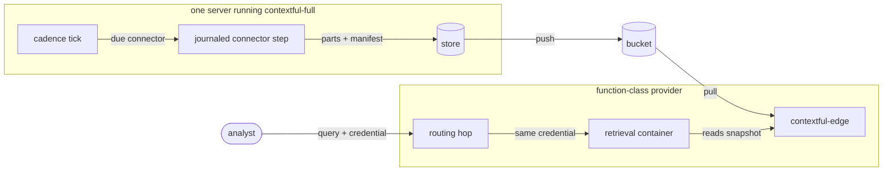

# System topology

## What it is for

**Contextful** is one engine that pulls data from sources, keeps it as open files, and answers questions over it under enforcement. This contract fixes the engine's shape: which half owns which job, the only places the halves touch, which binary links which capabilities, how a deployment proves it matches its declaration, and the one coordination primitive every writer relies on. Every other contract places itself on this map, so read this guide first.

## How it works

One Cargo workspace compiles the whole engine ({{topology.compose.workspace}}), split into two halves. The read path owns data at rest and its retrieval ({{topology.compose.read-path}}); the run path owns execution, meaning the journal, the scheduler, cursor commit and every connector, and owns no store ({{topology.compose.run-path}}).

The halves meet at exactly three crossings: the connector interface world, the columnar-part-plus-manifest layout, and the capability-token format ({{topology.compose.three-crossings}}). Picture two countries with three border posts. Each post runs under its own versioned treaty that both sides test against ({{topology.compose.crossing-version}}), and a graph test patrols the fence for any dependency that skips a post ({{topology.compose.undeclared-crossing}}). Because the run path hands over nothing but files and a manifest, a build without it still serves everything a daemon wrote ({{topology.compose.run-path-droppable}}).

Enforcement is part of the type system, not a layer an operator switches on. Every function returning a stored row takes the enforcement stack's admission value as a parameter, so a bypass fails to compile ({{topology.compose.mediation}}). Model access leaves through one OpenAI-compatible endpoint ({{topology.compose.inference-egress}}), and the engine calls no one home ({{topology.compose.local-first}}).

The workspace builds three profiles, each fixed at build time ({{topology.package.profile}}, {{topology.package.fixed-at-build}}). `contextful-edge` is the read replica ({{topology.package.edge-profile}}), `contextful-full` is the daemon ({{topology.package.full-profile}}), and `contextful-control` is the control plane and the one home of the CRDT library ({{topology.package.control-profile}}). All three share `contextful-core`, a crate of pure types and ports that every adapter depends on and that depends on no adapter ({{topology.package.domain-crate}}). A capability a profile does not link surfaces as a typed refusal when reached.

One declaration deploys to any provider, and a deploy proves itself by observation: each control-plane target's table parts compare byte for byte against the reference target ({{topology.deploy.parity}}), and each published hostname carries a descriptor whose declared gate an anonymous probe checks ({{topology.publish-hostname.posture-mismatch}}).

Coordination rests on one linearizable conditional write ({{topology.coordinate.primitive}}), reached only through the `Catalog` port ({{topology.coordinate.catalog-port}}). The set of operations needing a single writer is closed ({{topology.coordinate.inventory}}), and each lease row carries a fence that only grows ({{topology.coordinate.fence-advances}}).

## Worked example

A team runs `contextful-full` on one server with a local catalog file ({{topology.coordinate.backends}}) and serves analysts from a function-class provider.

- The cadence tick fires. The reconciler holds the deployment's cadence lease and renews it on a fixed interval ({{topology.coordinate.cadence-lease-renewal}}). The fallback cron fires only after taking that same lease ({{topology.coordinate.cadence-fallback}}), so two schedulers never dispatch one unit twice.
- The run path invokes a component connector as a journaled step; it runs because the full profile links a component host ({{topology.package.component-host}}).
- Rows cross to the read path as parts plus a manifest, and the cursor advances by one compare-and-swap on its stored version ({{topology.coordinate.cursor-cas}}).
- The store pushes to the bucket. The function-class provider hosts the edge profile alone ({{topology.package.edge-eligibility}}), which pulls the same parts and serves read-only SQL.
- An operator schedules the same component connector on the edge deployment. The dispatch refuses by name and substitutes no native source ({{topology.package.host-missing}}). A target capping per-invocation wall clock also excludes first-time backfills ({{topology.deploy.wall-clock-cap}}).
- The deploy probes the replica's hostname anonymously and fails if the answer falls outside the declared gate ({{topology.publish-hostname.posture-mismatch}}). An analyst's request then passes the routing hop to a retrieval container, which reaches readiness before its hydration finishes ({{topology.publish-hostname.container-readiness}}).

## Where to look

- Which half owns a job, and what crosses between them: `topology.compose`.
- What a binary links, and what it refuses: `topology.package`.
- Whether a provider can host a shape: `topology.deploy`.
- What a hostname exposes: `topology.publish-hostname`.
- Who may write concurrently: `topology.coordinate`.
- Where the engine ends and an application begins: `topology.bound-application`.
