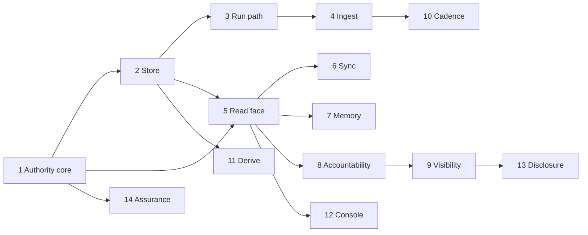

# Milestones

The order in which the corpus is built. A milestone names the operations it closes;
`contextful spec state` expands each to its clause set and reports the reach. A clause
belongs to at most one milestone and may belong to none — an unscheduled clause is
counted, never failed.

This file carries intent and order. It states nothing about behavior: every sentence
about what the system does lives in the contract file that owns it, and what the tree
demonstrates lives in [`status.md`](./status.md).

Nothing here carries a date. A milestone advances when the clause set it names computes
`performed`, which is the same gate the corpus applies to any other claim.

## 1 — The authority core

The smallest verified thing, built first, because every later milestone takes an
admitted authority as an argument rather than reaching for a credential.

| Operations | Intent |
| --- | --- |
| `authority.*` | The subject tuple and its attestation labels, the delegation profile, admission, the scoped session that carries every restriction, custody and revocation. |
| `formal.model`, `formal.prove`, `formal.audit-axioms` | The proof package, the authority-mapping theorems, and a proof gate that audits elaborated proofs rather than searching source text. |
| `formal.differ` | The randomized differential harness that ties the mechanized model to the implementation. |

Reach: an authority is admitted once, travels as a value, and is re-read at the effect
about to act. Nothing yet reads a row.

## 2 — The store

| Operations | Intent |
| --- | --- |
| `store.*` | The on-disk layout, snapshot commit, table declaration, reserved columns and namespaces, schema reconciliation, compaction, sidecar indexes, the two clocks, at-rest encryption. |

Reach: a table lands, a scan resolves its file list, and a reader opens the Parquet
without the engine.

## 3 — The run path

| Operations | Intent |
| --- | --- |
| `run.*` | Journal, cursor commit and awakeable; the determinism boundary, replay pinning, retry, cancellation, and the run record as a reserved store table. |
| `topology.compose`, `topology.package` | The crossings between the halves, the domain crate's purity, and the dependency direction the build enforces. |

Reach: a run crashes mid-step and resumes from its journal without re-issuing the side
effect.

## 4 — Ingest

| Operations | Intent |
| --- | --- |
| `pipeline.*` | The pipeline specification, its serializations and content hash, table models, write modes, partitioning, and the landing sequence. |
| `connector.*` | One interface in two authoring paths, the component world and its host-mediated capabilities, packaging and digest pinning, and the compiled-in sources. |
| `secret.*` | The two credential planes, the reference scheme and its provider chain, just-in-time hydration, the redacting wrapper, rotation. |

Reach: a declared pipeline pulls from a real source, lands rows under a cursor, and
never sees a credential in plaintext.

## 5 — The read face under enforcement

| Operations | Intent |
| --- | --- |
| `read.*` | View registration over an explicit file list, the statement guard, candidate generation bound by the query's own terms, ranking, the tool surface, result shape, the published model. |
| `enforcement.*` | The three layers as one reference monitor, row and column restriction, mask strategies, inference zones, and the fail-closed default for an unlabeled table. |

Reach: an agent asks a question over MCP and receives rows the caller's authority
admits, ranked, with the match count crossing the boundary so a store says it has no
answer.

## 6 — Sync and replicas

| Operations | Intent |
| --- | --- |
| `sync.*` | The bucket wire format, push and pull ordering, prefix confinement, conditional-write commit, leases, and the read replica. |

Reach: two nodes share one bucket and converge without a coordinator.

## 7 — Memory

| Operations | Intent |
| --- | --- |
| `memory.*` | The memory table shapes on the same substrate, the synthesis stages, belief revision within one valid-time line, provenance tiers, coverage gaps. |

Reach: a synthesized belief supersedes its predecessor on new evidence, and a reader
sees which grant produced it.

## 8 — Accountability

| Operations | Intent |
| --- | --- |
| `accountability.*` | The span every read emits, the hash-linked audit record, chain verification, negative assurance, erasure as a rewrite plus a one-hop cascade, the receipt, and the residency posture. |

Reach: an operator answers what a named person could have seen over a past window, from
the store, in SQL.

## 9 — Visibility

| Operations | Intent |
| --- | --- |
| `visibility.*` | The two-key rule, source permissions mirrored as ordinary tables, the staleness budget a read enforces, fidelity levels, and an answer leaving for a channel other people read. |

Reach: a revoked grant at the source stops answering within a bound the deployment
declares, and an unmirrored resource is invisible to every subject.

## 10 — Cadence and the operator plane

| Operations | Intent |
| --- | --- |
| `control.*` | The schedule grammar, the reconciler and its manifest, bounded dispatch under per-source and store-global exclusion keys, configuration apply, the operator portal, and the deployment posture of a published hostname. |
| `topology.deploy`, `topology.publish-hostname`, `topology.coordinate` | Provider-neutral targets, the descriptor every published hostname carries, and coordination as compare-and-swap behind the catalog port. |

Reach: due work dispatches into a bounded pool, a cold store still fires its schedules,
and a published hostname is probed for the posture it declares.

## 11 — The derive tier

| Operations | Intent |
| --- | --- |
| `derive.*` | Deferred per-row work over landed rows: the store-reading source, the work set recomputed by anti-join, the operator-defined engine, per-document resource bounds, and the failure row. |

Reach: a pipeline reads the words inside a document that already landed and fills them
into the parent row, keyed on content.

## 12 — The console

| Operations | Intent |
| --- | --- |
| `console.*` | The visitor-facing read surface: product language, the two trust layers, grounded answers, widgets, time travel, the trace panel. |

Reach: a non-technical visitor asks a question in their own words and gets an answer
that cites the rows behind it.

## 13 — Disclosure

| Operations | Intent |
| --- | --- |
| `disclosure.*` | Deriving a result without exposing rows: the two deployment settings, the disclosure budget enforced when the derived table is built, suppression, and the activatable segment. |

Reach: two parties compare against a benchmark neither can invert.

## 14 — Assurance

| Operations | Intent |
| --- | --- |
| `formal.*` | The remaining theorems: layer composition, monotone narrowing, the placement floor, complete mediation. |
| `build.*` | The gate's resource budget, test placement, typed automation, and the retrieval-quality harness. |

Reach: the properties the enforcement stack relies on are mechanized, their axiom
footprint is audited transitively, and the trusted dependency set is named rather than
assumed.
