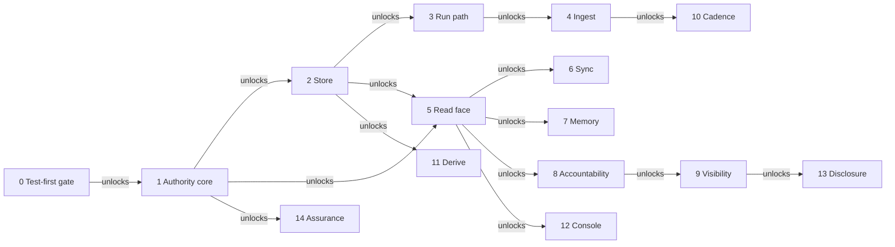

# Milestones

The order in which the corpus is built. A milestone names the operations it closes;
`contextful-spec state` expands each to its clause set and reports the reach in
[`status.md`](./status.md). An operation belongs to at most one milestone.

Each milestone's `Reach:` line is its acceptance criterion, and its `Acceptance:` line
names the test in `crates/acceptance/` that drives that reach through a built binary.
The acceptance test lands before the first clause of its milestone is pinned, ignored
while the milestone is open; the milestone closes when the ignore comes off and the
test passes.

A `Depth: operation` line specifies a milestone at operation level: its operations carry
refusal and limit clauses, unsettled lines and diagrams, and no behavior clause. Removing
the line when the milestone opens admits behavior clauses again.

## 0 — The test-first gate

| Operations | Intent |
| --- | --- |
| `assurance.automate`, `assurance.test` | Typed gate subcommands, the red-before-green check over every source change, and the acceptance package. |

Reach: A change altering source with no test failing against its base reds the gate before merge.

Acceptance: `contextful_acceptance::m00::m00_test_first_gate`

## 1 — The authority core

| Operations | Intent |
| --- | --- |
| `authority.identify`, `authority.profile`, `authority.grant`, `authority.attenuate`, `authority.issue`, `authority.verify`, `authority.revoke`, `authority.exchange` | The subject, delegation, admission, custody and revocation, with the proof package and differential harness beside them. |
| `assurance.model`, `assurance.prove`, `assurance.audit-assumptions`, `assurance.recheck`, `assurance.scope-claim`, `assurance.differential-test` | — |

Reach: An authority is admitted once, travels as a value, and is re-read at the effect about to act.

Acceptance: `contextful_acceptance::m01::m01_authority_core`

## 2 — The store

| Operations | Intent |
| --- | --- |
| `store.lay-out`, `store.declare`, `store.reserve`, `store.reconcile`, `store.fold`, `store.index`, `store.bound-time`, `store.encrypt` | Layout, declaration, reserved columns, reconciliation, commit and compaction, indexes, the two clocks, at-rest encryption. |

Reach: A table lands, a scan resolves its file list, and a reader opens the Parquet without the engine.

Acceptance: `contextful_acceptance::m02::m02_store`

## 3 — The run path

| Operations | Intent |
| --- | --- |
| `run.journal`, `run.advance`, `run.suspend`, `run.retry`, `run.own`, `run.cancel`, `run.record`, `run.project` | Journal, cursor, suspension, retry, cancellation and the run record; the crossings, packaging and coordination they rest on. |
| `topology.compose`, `topology.package`, `topology.coordinate` | — |

Reach: A run crashes mid-step and resumes from its journal without re-issuing a recorded effect.

Acceptance: `contextful_acceptance::m03::m03_run_path`

## 4 — Ingest

| Operations | Intent |
| --- | --- |
| `run.declare`, `run.compile`, `run.transform`, `run.normalize`, `run.guard-secrets`, `run.land`, `run.backfill`, `run.seed`, `run.publish` | The pipeline declaration and landing sequence, the connector world, and outbound credentials. |
| `connector.*` | — |

Reach: A declared pipeline pulls from a real source, lands rows under a cursor, and never holds a credential in plaintext.

Acceptance: `contextful_acceptance::m04::m04_ingest`

## 5 — The read face under enforcement

| Operations | Intent |
| --- | --- |
| `read.register`, `read.guard`, `read.respond`, `read.retrieve`, `read.rank`, `read.cache`, `read.resolve-pin`, `read.embed` | Registration, the statement guard, retrieval and ranking, the tool surface; the enforcement layers as one reference monitor. |
| `authority.redact`, `authority.compose`, `authority.filter-rows`, `authority.mask`, `authority.refuse`, `authority.bound-redistribution`, `authority.place`, `authority.resist` | — |

Reach: An agent asks over MCP and receives ranked rows the caller's authority admits.

Acceptance: `contextful_acceptance::m05::m05_read_face`

## 6 — Sync and replicas

| Operations | Intent |
| --- | --- |
| `store.push`, `store.pull`, `store.probe`, `store.merge`, `store.lease`, `store.replicate` | The bucket wire format, push and pull, the conditional-write probe, merge, fenced leases and the replica. |

Reach: Two nodes share one bucket and converge without a coordinator.

Depth: operation

Acceptance: `contextful_acceptance::m06::m06_sync`

## 7 — Memory

| Operations | Intent |
| --- | --- |
| `read.declare`, `read.synthesize`, `read.revise`, `read.recall`, `read.resolve-entity`, `read.settle` | Memory tables, synthesis, revision on one valid-time line, recall, entity resolution and settled outcomes. |

Reach: A synthesized belief supersedes its predecessor on new evidence, and a reader sees which grant produced it.

Acceptance: `contextful_acceptance::m07::m07_memory`

## 8 — Accountability

| Operations | Intent |
| --- | --- |
| `disclosure.record`, `disclosure.explain`, `disclosure.attest`, `disclosure.erase`, `disclosure.receipt` | The audit chain, explanation, attestation, erasure and the receipt. |

Reach: An operator answers what a named person could have seen over a past window, from the store, in SQL.

Depth: operation

Acceptance: `contextful_acceptance::m08::m08_accountability`

## 9 — Visibility

| Operations | Intent |
| --- | --- |
| `disclosure.mirror`, `disclosure.sweep`, `disclosure.reach`, `disclosure.bound-staleness`, `disclosure.declare-fidelity`, `disclosure.pack` | Source permissions mirrored as data, the sweep, reachability, the staleness budget and fidelity. |

Reach: A revoked grant at the source stops answering within a declared bound.

Depth: operation

Acceptance: `contextful_acceptance::m09::m09_visibility`

## 10 — Cadence and the operator plane

| Operations | Intent |
| --- | --- |
| `surface.arm`, `surface.reconcile`, `surface.fire`, `surface.dispatch`, `surface.edit`, `surface.apply`, `surface.reside`, `surface.register-store` | Schedules, reconciliation, bounded dispatch, configuration apply, deploy targets and published hostnames. |
| `topology.deploy`, `topology.publish-hostname`, `topology.bound-application` | — |

Reach: Due work dispatches into a bounded pool, and a published hostname is probed for the posture it declares.

Depth: operation

Acceptance: `contextful_acceptance::m10::m10_cadence`

## 11 — The derive tier

| Operations | Intent |
| --- | --- |
| `run.select`, `run.bind`, `run.exec`, `run.fetch`, `run.emit`, `run.parse-cues`, `run.test-engine` | Deferred per-row work over landed rows. |

Reach: A pipeline reads the words inside a landed document and fills them into the parent row.

Depth: operation

Acceptance: `contextful_acceptance::m11::m11_derive`

## 12 — The console

| Operations | Intent |
| --- | --- |
| `surface.visualize`, `surface.package`, `surface.speak`, `surface.ground`, `surface.plan-turn`, `surface.set-vantage`, `surface.browse`, `surface.learn`, `surface.render`, `surface.brief`, `surface.publish-answer` | The visitor-facing read surface and published answers. |

Reach: A visitor asks in their own words and gets an answer citing the rows behind it.

Depth: operation

Acceptance: `contextful_acceptance::m12::m12_console`

## 13 — Disclosure

| Operations | Intent |
| --- | --- |
| `disclosure.set-mode`, `disclosure.release`, `disclosure.suppress`, `disclosure.template`, `disclosure.bound-cohort` | Aggregate release under a disclosure budget. |

Reach: Two parties compare against a benchmark neither can invert.

Depth: operation

Acceptance: `contextful_acceptance::m13::m13_disclosure`

## 14 — Assurance

| Operations | Intent |
| --- | --- |
| `assurance.structure-tree`, `assurance.build`, `assurance.gate`, `assurance.evaluate`, `assurance.baseline` | The build gate, the build targets and the retrieval-quality harness. |

Reach: The gate holds its resource budget and the evaluation floors are measured on every change.

Acceptance: `contextful_acceptance::m14::m14_assurance`
