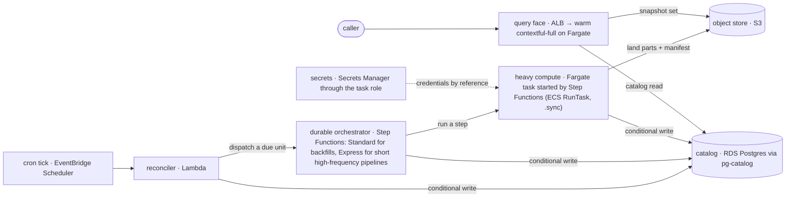
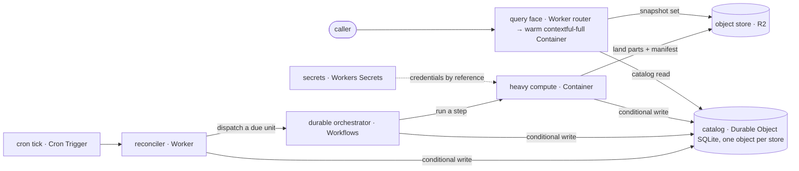
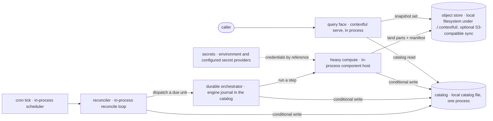

# Deployment targets

Generated by `contextful-spec state` from `spec/targets/*.toml`; not authored.
`corpus.targets` in [`00-corpus.md`](./00-corpus.md) states the rules every target file obeys; `topology.deploy` in [`01-topology.md`](./01-topology.md) the roles they fill.

## AWS

VPC-bound and regulated deployments, and teams already operating on AWS.

| Role | `lambda-fargate` (default) | `lambda-only` | `fargate-daemon` |
| --- | --- | --- | --- |
| cron tick | EventBridge Scheduler | EventBridge Scheduler | in-process scheduler |
| reconciler | Lambda | Lambda | in-process reconcile loop |
| durable orchestrator | Step Functions: Standard for backfills, Express for short high-frequency pipelines | Step Functions Express | engine journal in the catalog |
| single-writer catalog | RDS Postgres via pg-catalog | RDS Postgres via pg-catalog | RDS Postgres via pg-catalog |
| object store | S3 | S3 | S3 |
| hot-path query face | ALB → warm contextful-full on Fargate | Lambda function URL serving the read-only replica | ALB → contextful serve on Fargate |
| heavy compute | Fargate task started by Step Functions (ECS RunTask, .sync) | Lambda | in-process component host |
| secrets | Secrets Manager through the task role | Secrets Manager through the function role | Secrets Manager through the task role |
| realtime run projection | Fargate-hosted run projection | — | — |
| kind · profiles | orchestrated · full | function · edge | daemon · full |
| wall-clock cap · excluded | none · nothing | 15 min · first-time-backfill, component-connector | none · nothing |

The `lambda-fargate` shape:

## Cloudflare

Edge-first deployments on native object storage with near-zero idle cost.

| Role | `worker-container` (default) |
| --- | --- |
| cron tick | Cron Trigger |
| reconciler | Worker |
| durable orchestrator | Workflows |
| single-writer catalog | Durable Object SQLite, one object per store |
| object store | R2 |
| hot-path query face | Worker router → warm contextful-full Container |
| heavy compute | Container |
| secrets | Workers Secrets |
| realtime run projection | Durable Object with a hibernating WebSocket |
| kind · profiles | orchestrated · full |
| wall-clock cap · excluded | none · nothing |

The `worker-container` shape:

## Local (reference)

The reference output, development, and air-gapped single-node deployments.

| Role | `process` (default) |
| --- | --- |
| cron tick | in-process scheduler |
| reconciler | in-process reconcile loop |
| durable orchestrator | engine journal in the catalog |
| single-writer catalog | local catalog file, one process |
| object store | local filesystem under ./.contextful/, optional S3-compatible sync |
| hot-path query face | contextful serve, in process |
| heavy compute | in-process component host |
| secrets | environment and configured secret providers |
| realtime run projection | in-process WebSocket |
| kind · profiles | daemon · full |
| wall-clock cap · excluded | none · nothing |

The `process` shape:

